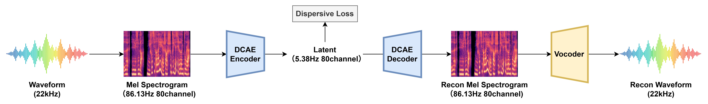

# DC-Speech-VAE: Deep-Compression Speech AutoEncoder
[](https://github.com/KdaiP/DC-Speech-VAE)
[](https://huggingface.co/KdaiP/DC-Speech-VAE)

Recent advances in **AR-diffusion** and **Continuous Autoregressive Language Models (CaLMs)** have marked a **paradigm shift** in generative modeling — transitioning the autoregressive (AR) objective from modeling **discrete tokens** to **continuous latents**.

While **discrete speech codecs** have achieved impressive progress, there remains a significant challenge in developing **low-frame-rate, noise-robust continuous speech representations** suitable for AR models.

To address this gap, we propose **DC-Speech-VAE**, a mel-based VAE that **compresses 22 kHz speech into a 5 Hz latent frame rate** while preserving high perceptual quality. Our approach integrates a set of **simple yet effective techniques** to ensure that the learned latent space is both **easy to model** and **robust to noise**, making it well-suited for autoregressive generation.

## Overview
<p align="center">
  
  <br>
  <em></em>
</p>

We use [DCAE](https://github.com/dc-ai-projects/DC-Gen) to compress mel-spectrogram by a factor of **16×**, and use a pretrained mel-vocoder([BigvganV2](https://github.com/NVIDIA/BigVGAN)) to convert the reconstructed mel-spectrogram to waveform.

### Key Features

* **Deep-Compression AutoEncoder (DCAE)**  
  Our model adopts the [DCAE](https://github.com/dc-ai-projects/DC-Gen) architecture as the backbone, compressing mel spectrograms by a factor of **16×** into a deeply compact latent representation.

* **Adversarial Training**  
  We employ a PatchGAN-like discriminator and a Multiband discriminator on mel spectrogram to maintain high perceptual quality.

* **σ-VAE and Latent Normalization**  
  Pure autoencoder training led to suboptimal generation. To improve robustness and prevent channel collapse, we adopt the [σ-VAE](https://arxiv.org/abs/2412.08635) strategy with latent normalization:
    - Add noise to the encoder latent during training.
    - Apply **LayerNorm** before passing the latent to the decoder, eliminating the need for additional pre-normalization in downstream generative models.

* **Semantic and Discriminative Latent Space**  
  We propose a variant of [dispersive loss](https://arxiv.org/abs/2506.09027) that treats each sample in a batch as a negative pair (similar to contrastive learning, but without positive pairs), forming a semantic and discriminative latent space which is generation friendly.  
    This encourages:
    - Semantically meaningful latent organization  
    - Discriminative separation between different samples  
    - Without relying on any external pretrained models or feature extractors (eg: [REPA](https://arxiv.org/abs/2410.06940)).

## Quick start

### 1. Download pretrained models

Download the pretrained checkpoints and place them at the following
paths:

| Model | Download Link | Purpose | Sampling Rate | Params |Download Destination |
|-----------|-----------|-----------|-----------|-----------|-------|
| DCAE | [🤗](https://huggingface.co/KdaiP/DC-Speech-VAE/blob/main/generator_700000.pt) | Mel Compressor | 22050 | 189M | `./checkpoints/generator_700000.pt`
| BigVGAN V2 | [🤗](https://huggingface.co/nvidia/bigvgan_v2_22khz_80band_256x/blob/main/bigvgan_generator.pt) | Mel Vocoder | 22050 | 112M | `./models/bigvgan_v2_22khz_80band_256x/bigvgan_generator.pt` 

> **Note:** Ensure that the filenames and paths match what you configure in your inference script.

### 2. Install dependencies

Our model is trained and tested on `pytorch=2.9`, `python=3.13`. Other pytorch and python versions are supported.

#### Install PyTorch

Follow the official PyTorch installation guide for your platform and hardware:

- <https://pytorch.org/get-started/locally>

#### Install ffmpeg

Since `torchaudio>=2.9` drop most of the useful features ([related issue](https://github.com/pytorch/audio/issues/3902)), we have to rely on ffmpeg and [torchcodec](https://github.com/meta-pytorch/torchcodec). Install the ffmpeg version that torchcodec supported.

``` bash
conda install "ffmpeg<8"
```

#### Install other dependencies

``` bash
pip3 install -r requirements.txt
```

### 3. Inference

See `inference.py` for a detailed usage example.

``` python
import torch
import torchaudio
from inference import DCAEInferenceWrapper

model_config = {
  'ae_model_path': 'checkpoints/generator_700000.pt',
  'ae_config_path': 'models/default_config.json',
  'vocoder_model_path': 'models/bigvgan_v2_22khz_80band_256x',
}

audio_input_path = 'path/to/input/audio/file.wav'
audio_output_path = 'path/to/output/audio/file.wav'

device = 'cuda'  # or 'cpu'
model = DCAEInferenceWrapper(**model_config).to(device)

audio, sample_rate = torchaudio.load(audio_input_path)
audio = audio.to(device)

with torch.inference_mode():
    reconstructed_audio = model(audio, sample_rate).cpu()

torchaudio.save(audio_output_path, reconstructed_audio, model.sample_rate)
```

## Training

Training is very simple, **no offline feature extraction or pretrained models are required**.

### 1. Generate Filelist

Run `preprocess/generate_filelist.py` to glob audio files and generate filelist for training.

```bash
python preprocess/generate_filelist.py \
    --out ./filelists/filelist.txt \
    --paths /path/to/audio/dir/1 \
    /path/to/audio/dir/2 \
    /path/to/audio/dir/n ...
```

This generates a text file in the following format:

```
audio_1.wav
audio_2.wav
...
```

Each line is a path to an audio file used for training.

### 2. Train DCAE Model

Run `train.py`


```bash
python train.py
```

Modify the `TrainConfig` in `train.py` to adjust training parameters such as paths, batch size, and training schedule.

<details>
<summary>Important Training Parameters</summary>

| Parameter            | Description                                   |
|----------------------|-----------------------------------------------|
| train_dataset_path   | Path to the training filelist `.txt` file     |
| **segment_samples**  | Audio segment length in samples               |
| **batch_size**       | Batch size per GPU node                       |
| output_channels      | Number of mel-spectrogram output channels     |
| **num_workers**      | Number of data loader worker threads          |
| max_steps            | Maximum training steps                        |
| model_save_path      | Checkpoint output directory                   |
| log_dir              | TensorBoard log directory                     |
| save_interval        | Model saving frequency (steps)                |

</details>

## Reference

This project builds on ideas and components from the following works and repositories:

- [HiFi-GAN](https://github.com/jik876/hifi-gan)
- [BigVGAN](https://github.com/NVIDIA/BigVGAN)
- [Vocos](https://github.com/gemelo-ai/vocos)
- [DAC](https://github.com/descriptinc/descript-audio-codec)
- [VITS](https://github.com/jaywalnut310/vits)
- [HiFi-VAE-GAN](https://github.com/OpenNSP/Hifi-vaegan)
- [DC-GEN](https://github.com/dc-ai-projects/DC-Gen)
- [CALM](https://github.com/shaochenze/calm)
- [taming-transformers](https://github.com/CompVis/taming-transformers)
- [single-codec](https://arxiv.org/abs/2406.07422)
- [HiFiSinger](https://arxiv.org/abs/2009.01776)
- [tortoise-tts](https://github.com/neonbjb/tortoise-tts)
- [ACE-Step](https://github.com/ace-step/ACE-Step)

## Spetial Thanks

- [zhiyongchenGREAT](https://github.com/zhiyongchenGREAT)
- [aizhiqi-work](https://github.com/aizhiqi-work)
- [ylzz1997](https://github.com/ylzz1997)
- [CNChTu](https://github.com/CNChTu)
